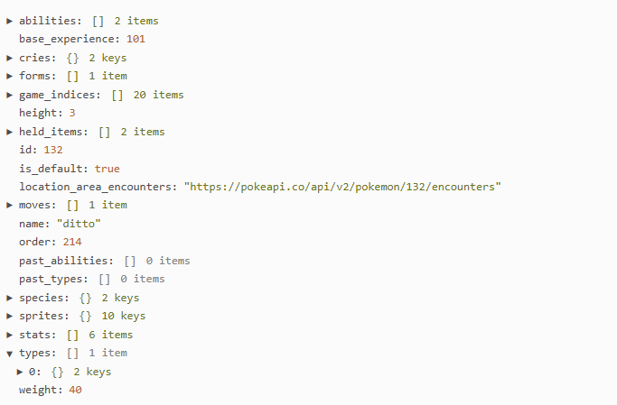

# Prova de Conceito: Fetch API 

## Feito Por:

- Artur Valladares Hernandez Giacummo - 10389053  
- Gabriel Marques Gonçalves Almeida - 10375711  

## Como Executar o Código

Para acessar o site proposto por esta prova de conceito (POC), você tem duas opções:

### Opção 1: Acesso Online

Você pode visualizar o projeto diretamente no navegador acessando o seguinte link:

[**https://gabrielogun.github.io/POC_FetchAPI/**](https://gabrielogun.github.io/POC_FetchAPI/)


### Opção 2: Acesso Local

Se preferir trabalhar com uma cópia local do projeto, siga os passos abaixo:

1. **Baixar o Projeto**  
   - Acesse o repositório do projeto e clique em **"Código"**.  
   - Selecione a opção **"Baixar ZIP"** para obter o arquivo compactado do projeto.  

2. **Descompactar o Arquivo**  
   - Após o download, localize o arquivo ZIP em seu computador.  
   - Descompacte o arquivo para uma pasta de sua escolha.  

3. **Abrir o Arquivo HTML**  
   - Navegue até a pasta descompactada.  
   - Abra o arquivo `index.html` em um navegador web de sua preferência (como Google Chrome, Mozilla Firefox, etc.).  

Com esses passos, você poderá visualizar e interagir com a prova de conceito localmente em seu computador.

Se precisar de ajuda adicional ou encontrar algum problema, sinta-se à vontade para entrar em contato!

## Visão Geral

Esta Prova de Conceito explica o que é e como utilizar o método `fetch` do JavaScript para consumo de APIs. Para isso, foi utilizada a API **PokéAPI**, que permite buscar informações de Pokémon.

### O que é `fetch`? 

`fetch` é uma função nativa do JavaScript utilizada para realizar requisições HTTP de maneira assíncrona, facilitando a comunicação com APIs para enviar e receber dados. Ao utilizar a `Fetch API`, o retorno é uma **Promise**, que representa o resultado de uma operação assíncrona e pode estar em um dos seguintes estados: **pendente**, **concluída com sucesso** ou **falha**. 

O método `fetch` recebe como parâmetro obrigatório a URL da requisição e, opcionalmente, um objeto com configurações, como cabeçalhos e métodos HTTP personalizados.

### Por que usar a função `fetch`?

- **Modernidade e Suporte**: O `fetch` é a alternativa moderna ao `XMLHttpRequest` e é suportado nativamente na maioria dos navegadores modernos.  
- **Simplificação de Código**: Ele oferece uma interface mais simples e legível para realizar operações assíncronas.  
- **Suporte a Promises**: O `fetch` retorna uma Promise, o que facilita o uso de `.then()`, `.catch()` e `async/await`, tornando o código mais conciso e organizado.  
- **Controle Avançado**: Permite customizar requisições com cabeçalhos, métodos HTTP, corpo da requisição e lidar com diferentes formatos de resposta (JSON, texto, binário).

## Funcionamento básico da PokeAPI

Para consumir dados da **PokéAPI**, é necessário construir a URL com base no nome do Pokémon desejado. No exemplo inicial, o endpoint utilizado é:

```
https://pokeapi.co/api/v2/pokemon/ditto
```

Para buscar informações de diferentes Pokémon, basta substituir `"ditto"` pela variável correspondente ao nome desejado:

```
https://pokeapi.co/api/v2/pokemon/${pokemonName}
```

Dessa forma, a função pode receber o nome do Pokémon como argumento e montar a URL dinamicamente, permitindo realizar a requisição para qualquer Pokémon especificado.

A resposta dessa requisição contém um objeto JSON na seguinte formatação:  


## Aplicação

Foi criada uma função que busca as informações de um Pokémon fornecido pelo usuário chamada `fetchPkm`, conforme apresentada a seguir:

```javascript
async function fetchPkm() {
    try {
        const pokemonName = document.getElementById("pokemonName").value.toLowerCase();
        const response = await fetch(`https://pokeapi.co/api/v2/pokemon/${pokemonName}`);

        if (!response.ok) {
            throw new Error("Não existe esse Pokémon");
        }

        const data = await response.json();
        const pokemonSprite = data.sprites.front_default;
        const imgElement = document.getElementById("pokemonSprite");
        imgElement.src = pokemonSprite;
        imgElement.style.display = "block";
    } catch (error) {
        console.error(error);
    }
}
```

### Estrutura da Função

A URL é formada utilizando o valor inserido pelo usuário no campo de entrada com o ID `pokemonName` e, em seguida, concatenada à URL base da PokeAPI para buscar informações do Pokémon correspondente:

```html
<input type="text" id="pokemonName" placeholder="Coloque o nome do Pokémon">
<button onclick="fetchPkm()">Buscar Pokémon</button><br>

```

### Passos da Função

```javascript
const pokemonName = document.getElementById("pokemonName").value.toLowerCase(); 
const response = await fetch(`https://pokeapi.co/api/v2/pokemon/${pokemonName}`);
```

Após realizar a requisição, `response.ok` verifica se a resposta foi bem-sucedida. Caso contrário, lança um erro que é tratado no bloco `catch`:

```javascript
if (!response.ok) {
    throw new Error("Não existe esse Pokémon");
}                
```

Se a resposta for válida, o conteúdo é convertido para um objeto JavaScript usando `await response.json()`, que permite acessar todas as propriedades do Pokémon, como o nome e suas sprites (imagens):

```javascript
const data = await response.json();
```

A propriedade `sprites.front_default` contém a URL da sprite padrão do Pokémon. Essa URL é então atribuída à propriedade `src` de um elemento `` no HTML para exibir a imagem correspondente na tela:

```javascript
const pokemonSprite = data.sprites.front_default;
const imgElement = document.getElementById("pokemonSprite");
imgElement.src = pokemonSprite;
imgElement.style.display = "block";
```

Caso o nome inserido não corresponda a nenhum Pokémon, a resposta não será bem-sucedida e `response.ok` retornará `false`. Isso faz com que a função dispare um erro, que é capturado no bloco `catch` e exibido no console.

## Resultado visual

  

## Referências

Por fim, incluímos uma lista de referências úteis para aprender mais sobre a função Fetch. Essas referências incluem links para documentações e tutoriais que podem ajudar a aprofundar seus conhecimentos no assunto.
